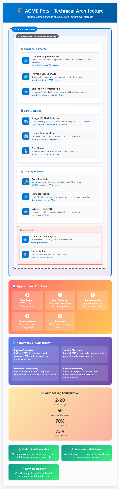

# Requirement 
The following is the list of requirements that ACME Pets need to have addressed in any proposed solution:
1.
The application needs to run in Azure, with a preference for services that abstract infrastructure management and overhead as much as possible
2.
The application needs to be highly available (within one region is sufficient), secure, performant, and cost effective
3.
The configuration for any public cloud resources must be written as IaC templates
a.
The creation of the required resources in the public cloud should be automated using a pipeline / workflow (CI/CD tooling)
b.
Ideally the templates / pipeline should be able to be used to deploy multiple environments (dev, test, prod) by passing through a variable / parameter
c.
Any passwords, credentials, API keys etc must be stored securely
4.
You must provide an observability plan (this does not need to be implemented), detailing how you will monitor this application
5.
Authentication is not required


Architecture Diagram


# 🚀 Complete Step-by-Step Guide: Node.js + PostgreSQL on Azure Container Apps

This guide will walk you through deploying Node.js applications with PostgreSQL database to Azure Container Apps using Terraform, with complete CI/CD pipeline setup.

## 📋 Table of Contents

1. [Prerequisites](#prerequisites)
2. [Project Setup](#project-setup)
3. [Azure Configuration](#azure-configuration)
4. [Node.js Application Preparation](#nodejs-application-preparation)
5. [Terraform Configuration](#terraform-configuration)
6. [Local Deployment](#local-deployment)
7. [CI/CD Pipeline Setup](#cicd-pipeline-setup)
8. [Testing and Verification](#testing-and-verification)
9. [Troubleshooting](#troubleshooting)

---

## 🛠️ Prerequisites

### Required Tools
```bash
# 1. Install Azure CLI
curl -sL https://aka.ms/InstallAzureCLIDeb | sudo bash

# 2. Install Terraform
wget https://releases.hashicorp.com/terraform/1.5.0/terraform_1.5.0_linux_amd64.zip
unzip terraform_1.5.0_linux_amd64.zip
sudo mv terraform /usr/local/bin/

# 3. Verify installations
az --version
terraform --version
```

### Azure Requirements
- Azure subscription with Contributor role
- Resource quota for Container Apps and PostgreSQL
- Domain for custom routing (optional)

### Development Requirements
- Node.js applications containerized
- Docker registry access (Azure Container Registry recommended)
- GitHub repository for CI/CD

---

## 📁 Project Setup

### Step 1: Create Project Structure
```bash
mkdir nodejs-containerapp-terraform
cd nodejs-containerapp-terraform

# Create directory structure
mkdir -p {modules/container-apps,environments/{dev,prod},.github/workflows,scripts/docker-examples}
```

### Step 2: Download Configuration Files
Copy all the Terraform files from the previous solution into your directory structure:

```
nodejs-containerapp-terraform/
├── modules/container-apps/
│   ├── main.tf
│   ├── variables.tf
│   └── outputs.tf
├── environments/
│   ├── dev/
│   │   ├── main.tf
│   │   ├── variables.tf
│   │   ├── terraform.tfvars
│   │   └── outputs.tf
│   └── prod/
│       ├── main.tf (copy from dev)
│       ├── variables.tf (copy from dev)
│       ├── terraform.tfvars
│       └── outputs.tf (copy from dev)
├── .github/workflows/
│   └── deploy.yml
├── scripts/
│   ├── deploy.sh
│   ├── setup-azure-backend.sh
│   └── docker-examples/
└── README.md
```

---

## ⚙️ Azure Configuration

### Step 3: Login to Azure
```bash
# Login to Azure
az login

# List subscriptions
az account list --output table

# Set your subscription
az account set --subscription "Your-Subscription-ID"
```

### Step 4: Create Service Principal for Terraform
```bash
# Create service principal
az ad sp create-for-rbac \
  --name "terraform-nodejs-containerapp" \
  --role "Contributor" \
  --scopes "/subscriptions/$(az account show --query id -o tsv)"
```

**📝 Save the output!** You'll need these values:
```json
{
  "appId": "xxxxxxxx-xxxx-xxxx-xxxx-xxxxxxxxxxxx",
  "displayName": "terraform-nodejs-containerapp",
  "password": "xxxxxxxx-xxxx-xxxx-xxxx-xxxxxxxxxxxx",
  "tenant": "xxxxxxxx-xxxx-xxxx-xxxx-xxxxxxxxxxxx"
}
```

### Step 5: Set Up Remote State Storage (Optional but Recommended)
```bash
# Run the setup script
chmod +x scripts/setup-azure-backend.sh
./scripts/setup-azure-backend.sh dev $(az account show --query id -o tsv)
```

This creates:
- Storage account for Terraform state
- Resource group for state management
- Blob container for state files

---

## 🐳 Node.js Application Preparation

### Step 6: Prepare Your Node.js Applications

#### A. Add Required Health Check Endpoints

Add these endpoints to your Node.js applications:

**app.js** (or your main application file):
```javascript
const express = require('express');
const { Pool } = require('pg');

const app = express();
const port = process.env.PORT || 3000;

// PostgreSQL connection
const pool = new Pool({
    connectionString: process.env.DATABASE_URL,
    ssl: process.env.NODE_ENV === 'production' ? { rejectUnauthorized: false } : false
});

app.use(express.json());

// 🏥 Health check endpoint (REQUIRED)
app.get('/health', async (req, res) => {
    try {
        // Test database connection
        await pool.query('SELECT 1');
        res.status(200).json({ 
            status: 'healthy', 
            timestamp: new Date().toISOString(),
            environment: process.env.NODE_ENV 
        });
    } catch (error) {
        res.status(503).json({ 
            status: 'unhealthy', 
            error: error.message,
            timestamp: new Date().toISOString()
        });
    }
});

// 🟢 Readiness check endpoint (REQUIRED)
app.get('/ready', async (req, res) => {
    try {
        await pool.query('SELECT 1');
        res.status(200).json({ 
            status: 'ready', 
            timestamp: new Date().toISOString()
        });
    } catch (error) {
        res.status(503).json({ 
            status: 'not ready', 
            error: error.message 
        });
    }
});

// Your other routes...
app.get('/', (req, res) => {
    res.json({ 
        message: 'Node.js Container App is running!',
        environment: process.env.NODE_ENV,
        version: '1.0.0'
    });
});

app.listen(port, '0.0.0.0', () => {
    console.log(`Server running on port ${port}`);
});
```

#### B. Update package.json
Ensure your package.json includes PostgreSQL dependencies:

```json
{
  "name": "your-nodejs-app",
  "version": "1.0.0",
  "dependencies": {
    "express": "^4.18.2",
    "pg": "^8.11.0",
    "cors": "^2.8.5",
    "helmet": "^7.0.0"
  },
  "scripts": {
    "start": "node app.js"
  }
}
```

#### C. Create Dockerfile
```dockerfile
FROM node:18-alpine

WORKDIR /usr/src/app

# Copy package files
COPY package*.json ./
RUN npm ci --only=production

# Copy source code
COPY . .

# Create non-root user
RUN addgroup -g 1001 -S nodejs && \
    adduser -S nextjs -u 1001 && \
    chown -R nextjs:nodejs /usr/src/app

USER nextjs

EXPOSE 3000

# Health check
HEALTHCHECK --interval=30s --timeout=3s --start-period=5s --retries=3 \
    CMD node -e "require('http').get('http://localhost:3000/health', (res) => { process.exit(res.statusCode === 200 ? 0 : 1) }).on('error', () => process.exit(1))"

CMD ["npm", "start"]
```

### Step 7: Build and Push Container Images

#### Option A: Using Azure Container Registry
```bash
# Create Azure Container Registry
az acr create \
  --resource-group "rg-your-project" \
  --name "youracrname" \
  --sku Basic

# Login to registry
az acr login --name youracrname

# Build and push images
docker build -t youracrname.azurecr.io/nodeapp1:latest ./app1
docker build -t youracrname.azurecr.io/nodeapp2:latest ./app2

docker push youracrname.azurecr.io/nodeapp1:latest
docker push youracrname.azurecr.io/nodeapp2:latest
```

#### Option B: Using Docker Hub
```bash
# Build and push to Docker Hub
docker build -t yourusername/nodeapp1:latest ./app1
docker build -t yourusername/nodeapp2:latest ./app2

docker push yourusername/nodeapp1:latest
docker push yourusername/nodeapp2:latest
```

---

## 🔧 Terraform Configuration

### Step 8: Configure Development Environment

Edit `environments/dev/terraform.tfvars`:

```hcl
# Environment Configuration
environment = "dev"
location = "Australia East"

# Resource Names (MUST BE GLOBALLY UNIQUE)
resource_group_name = "rg-nodeapp-dev-australiaeast"
container_app_environment_name = "cae-nodeapp-dev-australiaeast"
key_vault_name = "kv-nodeapp-dev-12345"  # Change 12345 to random numbers
postgres_server_name = "postgres-nodeapp-dev-12345"  # Change 12345 to random numbers

# Application Configuration
app1_name = "nodeapp1-dev"
app2_name = "nodeapp2-dev"
app1_image = "youracrname.azurecr.io/nodeapp1:latest"  # 👈 UPDATE THIS
app2_image = "youracrname.azurecr.io/nodeapp2:latest"  # 👈 UPDATE THIS
app1_port = 3000
app2_port = 3000

# Database Configuration
postgres_database_name = "nodeapp_dev"
postgres_admin_username = "postgresadmin"
postgres_admin_password = ""  # Will be set via environment variable
postgres_sku_name = "B_Standard_B1ms"  # Basic tier for dev
postgres_storage_mb = 32768  # 32GB
postgres_version = "15"

# Scaling Configuration
min_replicas = 2
max_replicas = 5
node_env = "development"

# Tags
tags = {
  Environment = "dev"
  Project = "nodejs-containerapp"
  ManagedBy = "terraform"
  Stack = "nodejs-postgresql"
}
```

### Step 9: Configure Production Environment

Edit `environments/prod/terraform.tfvars`:

```hcl
# Environment Configuration
environment = "prod"
location = "Australia East"

# Resource Names (MUST BE GLOBALLY UNIQUE)
resource_group_name = "rg-nodeapp-prod-australiaeast"
container_app_environment_name = "cae-nodeapp-prod-australiaeast"
key_vault_name = "kv-nodeapp-prod-12345"  # Change 12345 to random numbers
postgres_server_name = "postgres-nodeapp-prod-12345"  # Change 12345 to random numbers

# Application Configuration
app1_name = "nodeapp1-prod"
app2_name = "nodeapp2-prod"
app1_image = "youracrname.azurecr.io/nodeapp1:latest"  # 👈 UPDATE THIS
app2_image = "youracrname.azurecr.io/nodeapp2:latest"  # 👈 UPDATE THIS
app1_port = 3000
app2_port = 3000

# Database Configuration
postgres_database_name = "nodeapp_prod"
postgres_admin_username = "postgresadmin"
postgres_admin_password = ""  # Will be set via environment variable
postgres_sku_name = "GP_Standard_D2s_v3"  # General Purpose tier for prod
postgres_storage_mb = 131072  # 128GB
postgres_version = "15"

# Scaling Configuration
min_replicas = 3
max_replicas = 20
node_env = "production"

# Tags
tags = {
  Environment = "prod"
  Project = "nodejs-containerapp"
  ManagedBy = "terraform"
  Stack = "nodejs-postgresql"
}
```

---

## 🚀 Local Deployment

### Step 10: Deploy Development Environment

#### A. Set Database Password
```bash
# Set a secure password for PostgreSQL
export TF_VAR_postgres_admin_password="YourSecurePassword123!"
```

#### B. Make Deploy Script Executable
```bash
chmod +x scripts/deploy.sh
```

#### C. Run Deployment
```bash
# Navigate to project root
cd nodejs-containerapp-terraform

# Plan the deployment (dry-run)
./scripts/deploy.sh dev plan

# If plan looks good, apply the changes
./scripts/deploy.sh dev apply
```

### Step 11: Verify Deployment

The deployment script will output the application URLs:

```bash
✅ Deployment completed successfully!

📊 Deployment Summary:
======================
🌐 App 1 URL: https://nodeapp1-dev.kindhill-12345678.australiaeast.azurecontainerapps.io
🌐 App 2 URL: https://nodeapp2-dev.kindhill-12345678.australiaeast.azurecontainerapps.io
🗄️  PostgreSQL Server: postgres-nodeapp-dev-12345.postgres.database.azure.com
📊 Database Name: nodeapp_dev

🔍 Health Check Endpoints:
  - https://nodeapp1-dev.kindhill-12345678.australiaeast.azurecontainerapps.io/health
  - https://nodeapp1-dev.kindhill-12345678.australiaeast.azurecontainerapps.io/ready
  - https://nodeapp2-dev.kindhill-12345678.australiaeast.azurecontainerapps.io/health
  - https://nodeapp2-dev.kindhill-12345678.australiaeast.azurecontainerapps.io/ready
```

### Step 12: Test Your Applications
```bash
# Test App 1
curl https://your-app1-url/health
curl https://your-app1-url/ready
curl https://your-app1-url/

# Test App 2
curl https://your-app2-url/health
curl https://your-app2-url/ready
curl https://your-app2-url/
```

---

## 🔄 CI/CD Pipeline Setup

### Step 13: Configure GitHub Repository

#### A. Create GitHub Repository
```bash
# Initialize git repository
git init
git add .
git commit -m "Initial commit: Node.js Container Apps with PostgreSQL"

# Add remote and push
git remote add origin https://github.com/yourusername/nodejs-containerapp-terraform.git
git branch -M main
git push -u origin main

# Create develop branch
git checkout -b develop
git push -u origin develop
```

#### B. Set GitHub Secrets

Go to your GitHub repository → Settings → Secrets and variables → Actions

Add these **Repository secrets**:

| Secret Name | Value | Description |
|-------------|--------|-------------|
| `AZURE_CLIENT_ID` | `appId` from Step 4 | Service Principal Client ID |
| `AZURE_CLIENT_SECRET` | `password` from Step 4 | Service Principal Secret |
| `AZURE_SUBSCRIPTION_ID` | Your subscription ID | Azure Subscription |
| `AZURE_TENANT_ID` | `tenant` from Step 4 | Azure Tenant ID |
| `POSTGRES_ADMIN_PASSWORD` | Your secure password | Database password |

### Step 14: Test CI/CD Pipeline

#### A. Test Development Deployment
```bash
# Make a change and push to develop branch
git checkout develop
echo "# Updated README" >> README.md
git add README.md
git commit -m "Test dev deployment"
git push origin develop
```

#### B. Test Production Deployment
```bash
# Merge to main for production deployment
git checkout main
git merge develop
git push origin main
```

#### C. Monitor GitHub Actions
- Go to your repository → Actions tab
- Watch the deployment progress
- Check for any errors or warnings

---

## ✅ Testing and Verification

### Step 15: Comprehensive Testing

#### A. Application Functionality
```bash
# Test health endpoints
curl -f https://your-app-url/health || echo "Health check failed"
curl -f https://your-app-url/ready || echo "Readiness check failed"

# Test main application
curl https://your-app-url/
```

#### B. Database Connectivity
```bash
# Connect to PostgreSQL (requires password)
az postgres flexible-server connect \
  --name postgres-nodeapp-dev-12345 \
  --admin-user postgresadmin \
  --database-name nodeapp_dev
```

#### C. Auto-scaling Test
```bash
# Generate load to test auto-scaling (install Apache Bench)
sudo apt-get install apache2-utils

# Generate load
ab -n 1000 -c 10 https://your-app-url/
```

#### D. Monitor Resources
```bash
# View Container App status
az containerapp show \
  --name nodeapp1-dev \
  --resource-group rg-nodeapp-dev-australiaeast

# View logs
az containerapp logs show \
  --name nodeapp1-dev \
  --resource-group rg-nodeapp-dev-australiaeast
```

### Step 16: Validate Security

#### A. Check Key Vault Secrets
```bash
# List secrets in Key Vault
az keyvault secret list --vault-name kv-nodeapp-dev-12345 --output table

# Verify PostgreSQL connection string is stored
az keyvault secret show \
  --vault-name kv-nodeapp-dev-12345 \
  --name postgres-connection-string \
  --query "value" -o tsv
```

#### B. Verify HTTPS-only Access
```bash
# This should fail (redirect to HTTPS)
curl -v http://your-app-url/

# This should succeed
curl -v https://your-app-url/
```

---

## 🔧 Troubleshooting

### Common Issues and Solutions

#### Issue 1: "Key Vault name already exists"
**Error**: `The vault name 'kv-nodeapp-dev-001' is already taken`

**Solution**: Update Key Vault name in terraform.tfvars:
```hcl
key_vault_name = "kv-nodeapp-dev-98765"  # Use different numbers
```

#### Issue 2: "PostgreSQL server name already exists"
**Error**: `Server name 'postgres-nodeapp-dev-001' is not available`

**Solution**: Update PostgreSQL server name:
```hcl
postgres_server_name = "postgres-nodeapp-dev-98765"  # Use different numbers
```

#### Issue 3: Container app won't start
**Symptoms**: App shows as "Provisioning" or health checks fail

**Debug Steps**:
```bash
# Check container app logs
az containerapp logs show \
  --name nodeapp1-dev \
  --resource-group rg-nodeapp-dev-australiaeast \
  --follow

# Common issues:
# - Missing /health endpoint in your app
# - Wrong PORT environment variable
# - Database connection issues
# - Image not accessible
```

#### Issue 4: Database connection fails
**Symptoms**: Health checks return 503, database connection errors

**Debug Steps**:
```bash
# Test database connectivity
az postgres flexible-server connect \
  --name your-postgres-server \
  --admin-user postgresadmin

# Check firewall rules
az postgres flexible-server firewall-rule list \
  --name your-postgres-server \
  --resource-group your-resource-group
```

#### Issue 5: GitHub Actions fails
**Symptoms**: CI/CD pipeline errors

**Debug Steps**:
1. Check GitHub Secrets are set correctly
2. Verify Service Principal has Contributor role
3. Check Terraform syntax: `terraform validate`
4. Review Azure subscription limits

### Getting Help

#### View Container App Details
```bash
az containerapp show \
  --name your-app-name \
  --resource-group your-resource-group \
  --output table
```

#### View All Resources
```bash
az resource list \
  --resource-group rg-nodeapp-dev-australiaeast \
  --output table
```

#### Clean Up Resources
```bash
# Destroy development environment
./scripts/deploy.sh dev destroy

# Or delete resource group (faster)
az group delete --name rg-nodeapp-dev-australiaeast --yes --no-wait
```

---

## 🎉 Success Checklist

After completing this guide, you should have:

- ✅ Two Node.js applications running on Azure Container Apps
- ✅ PostgreSQL database with secure connections
- ✅ Auto-scaling based on load (2-5 replicas for dev, 3-20 for prod)
- ✅ Health checks and monitoring
- ✅ HTTPS-only access with automatic SSL certificates
- ✅ Secrets stored securely in Azure Key Vault
- ✅ CI/CD pipeline with GitHub Actions
- ✅ Multi-environment support (dev/prod)
- ✅ Infrastructure as Code with Terraform

## 🚀 Next Steps

1. **Add Custom Domain**: Configure custom domains for your applications
2. **Implement Caching**: Add Redis cache for better performance
3. **Enhanced Monitoring**: Set up Application Insights for detailed monitoring
4. **Blue-Green Deployments**: Implement advanced deployment strategies
5. **Database Migrations**: Automate database schema migrations
6. **Security Scanning**: Add container vulnerability scanning to CI/CD

---

**🎯 You now have a production-ready Node.js application infrastructure on Azure!**